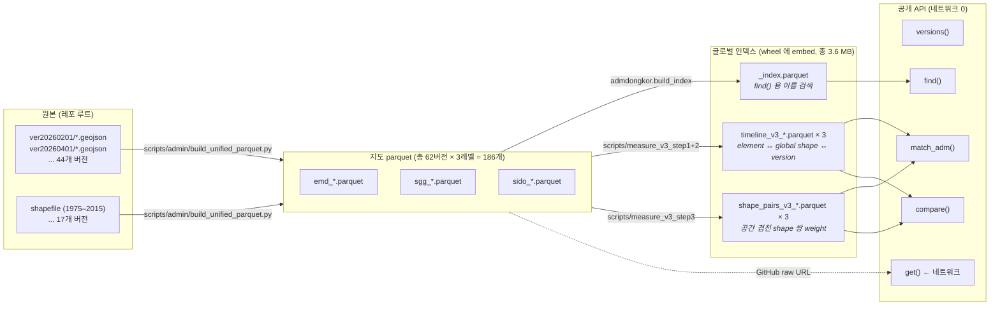
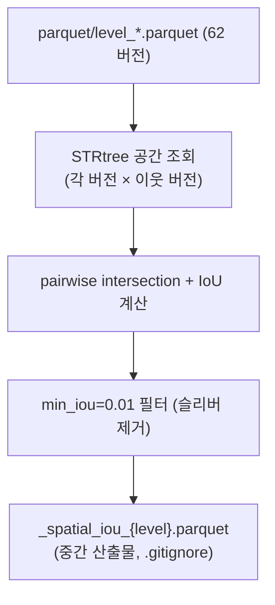
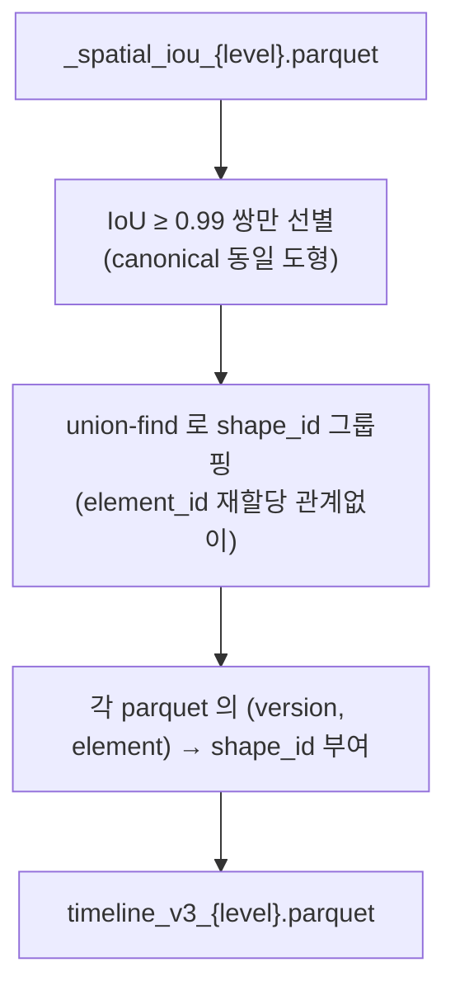
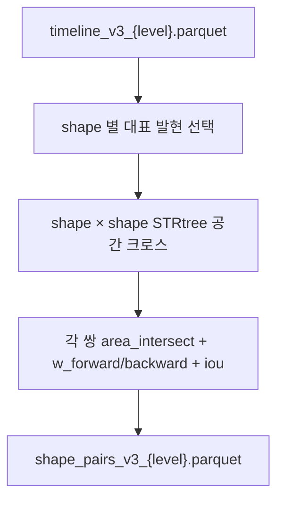
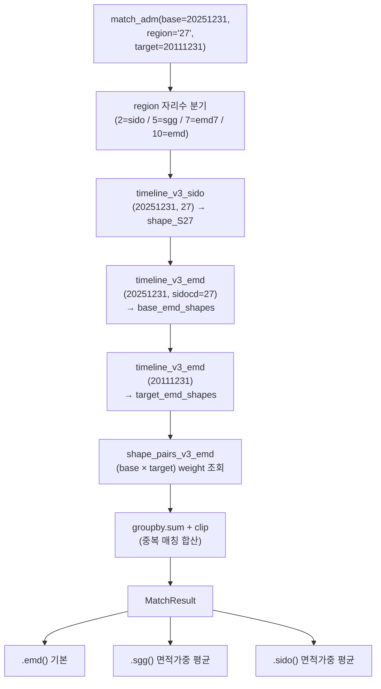

# admdongkor — 인덱스 구조 도해

라이브러리가 쓰는 **4 종의 인덱스 파일**이 어떻게 만들어지고 어떤 API 함수가
어떻게 참조하는지 한 눈에. 숫자는 2026-04-23 기준 실측.

---

## 0. 한 장 요약



---

## 1. 데이터 흐름 — 4단계

### 1-1. 원본 → 지도 parquet (Phase 1)

```
 ver20260201/HangJeongDong_ver20260201.geojson       (34 MB, GeoJSON)
        │
        ▼  scripts/admin/geojson_loader.py
        │  · 44 버전 헤테로지니 필드명 자동 감지 (adm_cd 7/8/10자리)
        │  · CRS 거짓말 탐지 + to_crs(EPSG:5179)
        │  · make_valid() 위상 수복
        ▼
 통일 스키마 GeoDataFrame (emd 레벨)
   emd7, emd8, emdcd, emdnm, sggcd, sggnm, sidocd, sidonm, area, geom
        │
        ▼  scripts/admin/dissolve.py (emd → sgg → sido union)
        │
        ▼
 parquet/emd_20260201.parquet   11.2 MB   3558 행
 parquet/sgg_20260201.parquet    4.6 MB    255 행
 parquet/sido_20260201.parquet   2.3 MB     17 행
```

### 1-2. 지도 parquet → 글로벌 인덱스 (Phase 2 + 3)

```
parquet/{emd,sgg,sido}_*.parquet   ×  62 버전  ×  3 레벨  =  186 파일
                    │
                    │
                    ├─────────────┐
                    │             │
                    ▼             ▼
         [Phase 2]          [Phase 3]
         build_index       measure_v3_step1/2/3
                    │             │
                    ▼             ▼
         _index.parquet    timeline_v3_*.parquet
                          shape_pairs_v3_*.parquet
                    │             │
                    └─────┬───────┘
                          ▼
              lib/src/admdongkor/data/
              (wheel 에 embed, 총 3.6 MB)
```

---

## 2. 인덱스 4종 — 스키마와 역할

### 2-1. `_index.parquet` — 이름 검색 (find)

```
┌─────────────────────────────────────────────────────────────┐
│ _index.parquet                           233,297 행 / 1.7 MB │
├─────────────────────────────────────────────────────────────┤
│ version_key | level | code    | code7 | code8 | name  | ... │
├─────────────────────────────────────────────────────────────┤
│ 19751231    | sido  | <NA>    | <NA>  | <NA>  | 서울...│     │
│ 19751231    | sgg   | 11010   | <NA>  | <NA>  | 종로구 │     │
│ 19751231    | emd   | 1101... | 11010 | <NA>  | 종로1가│     │
│ ...                                                         │
│ 20260401    | emd   | 1111... | ...   | ...   | 청운동 │     │
└─────────────────────────────────────────────────────────────┘

추가 컬럼: sggcd, sggnm, sidocd, sidonm, _fullpath (내부 검색용)

용도: find("서울 종로") → _fullpath 에 str.contains → 후보 행들 반환
      한 레벨 당 약 3,500 (emd) / 250 (sgg) / 17 (sido) × 62 버전
```

### 2-2. `timeline_v3_{sido,sgg,emd}.parquet` — element ↔ global shape ↔ version

**핵심 아이디어**: emdcd/sggcd/sidocd 는 **재할당되는 코드**. 2023 군위군은
`경북(47)` → `대구(27)` 로 code 가 바뀜. 하지만 **도형은 그대로**. 그래서
도형 공간의 독립 식별자 `shape_id` 를 도입.

```
┌────────────────────────────────────────────────────────────────┐
│ timeline_v3_emd.parquet             204,131 행 / 10,771 shape  │
├────────────────────────────────────────────────────────────────┤
│ level | version_key | element_id | shape_id | name  | area    │
├────────────────────────────────────────────────────────────────┤
│ emd   | 19901231    | 1111051000 |        8 | 청운동 | 1.61e6  │
│ emd   | 19951231    | 1111051000 |        8 | 청운동 | 1.61e6  │  ← 같은 shape_id: 도형 동일
│ emd   | 20001231    | 1111051000 |        8 | 청운동 | 1.61e6  │
│ ...                                                             │
│ emd   | 20231231    | 2711080000 |    5421  | 우보면 | ...     │  ← 군위, code 47 → 27 로 바뀜
│ emd   | 20221231    | 4772032000 |    5421  | 우보면 | ...     │     하지만 shape_id 동일 (도형 유지)
└────────────────────────────────────────────────────────────────┘

레벨별 규모:
  sido:  970 행 /    39 global shapes /  74 shape_pairs
  sgg:  14,520 행 /   596 global shapes / 888 shape_pairs
  emd: 204,131 행 / 10,771 global shapes / 23,736 shape_pairs

element_id = 행정코드 (emd 는 emdcd, sgg 는 sggcd, sido 는 sidocd)
shape_id   = 공간 도형 식별자 (IoU ≥ 0.99 로 union-find 통합)
```

### 2-3. `shape_pairs_v3_{sido,sgg,emd}.parquet` — 공간 겹친 shape 쌍 weight

**왜 필요한가**: 두 시점에서 **경계가 다른** shape 끼리 인구·면적 안분하려면
forward/backward weight 가 필요. 연쇄 곱 하지 말고 직접 저장.

```
┌─────────────────────────────────────────────────────────────────────┐
│ shape_pairs_v3_emd.parquet                    23,736 행 / ~1 MB     │
├─────────────────────────────────────────────────────────────────────┤
│ shape_id_a | shape_id_b | rep_version_a | rep_element_a | area_a    │
│ 9694       | 10410      | 20160201      | 3611051000    | 1.52e7    │
│                                                                     │
│ rep_version_b | rep_element_b | area_b | area_intersect              │
│ 20220101      | 3611055600    | 8.74e6 | 3.33e6                      │
│                                                                     │
│ w_forward     | w_backward    | iou                                 │
│ 0.219         | 0.381         | 0.162                                │
└─────────────────────────────────────────────────────────────────────┘

의미:
  w_forward  = area(A ∩ B) / area(A)    "A 의 어느 비율이 B 쪽으로"
  w_backward = area(A ∩ B) / area(B)    "B 의 어느 비율이 A 쪽에서 왔나"
  iou        = area(A ∩ B) / area(A ∪ B)

rep_version / rep_element 는 해당 shape 의 **대표 발현** (timeline 에 있는
어느 한 버전). 실제 intersection 계산은 rep 의 geometry 로 함.
```

### 2-4. `_versions.py` — 버전 키 상수 (소스 코드)

```python
# lib/src/admdongkor/_versions.py — parquet/emd_*.parquet 스캔 자동 재생성
VERSIONS: list[str] = [
    "19751231", "19801231", "19851231", ...,
    "20260201", "20260401",
]
```

`versions()` API 는 이 리스트를 그대로 반환. 네트워크 0, 인덱스 로드 0.

---

## 3. 빌드 파이프라인 (`scripts/measure_v3_*`)

### Step 1 — 공간 크로스 pairwise IoU



emd 레벨은 50 workers 병렬 처리, ~11분 소요.

### Step 2 — union-find → global shape_id + timeline



### Step 3 — 공간 겹친 shape 쌍 intersection



**왜 직접 저장하나?** pair 연쇄로 2025 대구 → 2011 대구 를 가려면 중간 버전
거쳐야 하는데 누적 오차 발생. 공간 겹친 모든 쌍 (23,736 개) 을 직접 저장하면
**단일 조회로 끝남**.

---

## 4. API 함수별 조회 흐름

### 4-1. `versions()` — 가장 단순

```
사용자 코드                 인덱스 접근
─────────────              ───────────
adk.versions()     ──────▶  _versions.py 의 VERSIONS 상수 반환
                            (파일 I/O 없음)
```

### 4-2. `find("서울 종로")` — 이름 검색

```
사용자 코드                              인덱스 접근
─────────────                           ───────────
adk.find("서울 종로")                    _index.parquet (embed, 1회 로드 후 LRU 캐시)
     │
     ├─ 토큰 분리: ["서울", "종로"]
     ├─ 2 토큰 → 자동 level = sgg
     ├─ 쿼리 NFC 정규화 + 공백 제거 + casefold
     │  → "서울종로"
     └─ DataFrame 필터:
          df[level == "sgg"]
          df[_fullpath.str.contains("서울종로", regex=False)]

→ FindResult (pd.DataFrame 서브클래스)
  .versions() / .first() / .last() 체이닝 지원
```

### 4-3. `match_adm(base="20251231", region="27", target="20111231")` — 영역 시계열 매칭

**예제 시나리오**: 2025 시점의 대구(27) 영역을 2011 시점에서는 어느 읍면동들이
차지했는가? (군위군 편입 역산)

```
Step A) base 영역 분해
  region = "27" (2자리 → sido)
  timeline_v3_sido 에서:
    (version=20251231, element_id=27) → shape_id=S27
  timeline_v3_emd 에서:
    (version=20251231, sidocd=27) → base_emd_shapes = {S1, S2, ..., Sn}

Step B) target 시점의 같은 영역 후보
  timeline_v3_emd 에서:
    (version=20111231) 의 모든 emd → target_shapes

Step C) weight 조회 — shape_pairs_v3_emd
  각 (base_shape, target_shape) 쌍에 대해:
    ┌─────────────────────────────────────────────────┐
    │ shape_id_a = base_shape, shape_id_b = target    │
    │ → w_backward = area(∩)/area(target)             │
    │ (base 가 a 쪽이면 backward, b 쪽이면 forward)    │
    └─────────────────────────────────────────────────┘
  base 가 여러 emd → 같은 target emd 가 중복 매칭
    → groupby(target_element_id).weight.sum().clip(0, 1)

Step D) 최종 출력
  MatchResult DataFrame:
    version_key | emdcd | emdnm | sggcd | sggnm | area | weight
    ─────────────────────────────────────────────────────────
    20111231    | 27... | 중구  | 27110 | ...   |  ... | 1.0
    20111231    | 47... | 군위  | 47720 | 경북  |  ... | 1.0   ← 당시 경북
    ...
```



### 4-4. `compare(["20251231", "20111231"])` — 두 시점 diff

```
compare 는 emdcd 기준 (shape_id 기준 아님) — 행정경계 관점 비교.

┌──────────────────────────────────────────────────────────────┐
│ Step 1) timeline_v3_emd 에서 두 버전 행 가져오기              │
│   A = timeline[version == 20251231]    # emdcd → shape_id    │
│   B = timeline[version == 20111231]                          │
│                                                              │
│ Step 2) emdcd 기준 left/right/inner 분해                      │
│   only_in_A = A.emdcd - B.emdcd                              │
│   only_in_B = B.emdcd - A.emdcd                              │
│   common    = A.emdcd ∩ B.emdcd                              │
│                                                              │
│ Step 3) common 에 대해 IoU 조회                               │
│   shape_pairs_v3_emd 에서                                     │
│   (shape_A, shape_B) 쌍 → iou                                │
│   iou ≥ 0.99 → same                                          │
│   iou <  0.99 → changed                                      │
└──────────────────────────────────────────────────────────────┘

→ CompareResult:
  .same()  : 2 rows per emdcd (A 행 + B 행)
  .diff()  : status = "same"/"changed"/"only_in_a"/"only_in_b"
```

---

## 5. 배포 계층 (wheel embed)

```
PyPI 업로드 되는 wheel:
  admdongkor-0.5.0-py3-none-any.whl  (~ 4 MB)
    ├─ admdongkor/
    │   ├─ __init__.py, api.py, _match.py, _compare.py, ...
    │   └─ data/                       ← importlib.resources 로 읽음
    │       ├─ _index.parquet              1.7 MB
    │       ├─ timeline_v3_sido.parquet      8 KB
    │       ├─ timeline_v3_sgg.parquet     126 KB
    │       ├─ timeline_v3_emd.parquet     1.5 MB
    │       ├─ shape_pairs_v3_sido.parquet   3 KB
    │       ├─ shape_pairs_v3_sgg.parquet   28 KB
    │       └─ shape_pairs_v3_emd.parquet  380 KB
    └─ ...

→ find() / match_adm() / compare() 는 네트워크 0.
  get() 만 첫 호출 시 GitHub raw 에서 parquet 다운 (OS 캐시 위치).
```

---

## 6. 숫자로 보는 규모 (2026-04-23 기준)

```
┌─────────┬──────────┬─────────────┬────────────────┬─────────────┐
│ 레벨    │ 지도 행수│ timeline 행 │ global shapes  │ shape_pairs │
├─────────┼──────────┼─────────────┼────────────────┼─────────────┤
│ sido    │     17   │       970   │          39    │       74    │
│ sgg     │    255   │    14,520   │         596    │      888    │
│ emd     │  3,558   │   204,131   │      10,771    │   23,736    │
├─────────┼──────────┼─────────────┼────────────────┼─────────────┤
│ 총 버전 │   62 (1975–2026, 4개월 주기 + shapefile 이관 버전들)  │
│ embed   │   3.6 MB (비압축), wheel 에 통째로 포함               │
│ 원본    │   parquet/ 3종 × 62 = 186 파일 / 약 2.2 GB            │
└─────────┴──────────┴─────────────┴────────────────┴─────────────┘
```

---

## 7. 용어 정리

| 용어                    | 의미                                                                          |
| ----------------------- | ----------------------------------------------------------------------------- |
| **element_id**          | 행정코드 (emdcd 10자리, sggcd 5자리, sidocd 2자리). **재할당됨** (군위 47→27) |
| **shape_id**            | 공간 도형 식별자. IoU≥0.99 로 union-find 통합. **재할당 없음**                |
| **version_key**         | 버전 문자열 `YYYYMMDD`. 1975–2015 는 `YYYY1231`, 2012+ 는 실제 시행일         |
| **rep_version/element** | shape 의 대표 발현 — intersection 계산 시 쓰는 geometry 의 출처               |
| **w_forward**           | `area(A ∩ B) / area(A)` — A 의 몇 % 가 B 로                                   |
| **w_backward**          | `area(A ∩ B) / area(B)` — B 의 몇 % 가 A 에서 왔나                            |
| **iou**                 | `area(A ∩ B) / area(A ∪ B)` — 경계 유지성                                     |
| **canonical 동일성**    | IoU ≥ 0.99 → "같은 도형으로 간주" (슬리버·라운딩 흡수)                        |

---

## 8. 자주 하는 오해

> **Q. timeline 과 shape_pairs 가 둘 다 필요한가? timeline 만으로 안 되나?**
>
> timeline 은 **(version, element) → shape_id** 일방향 매핑. "이 element 가
> 어느 도형" 까지만 앎. 두 시점 사이의 **면적 겹침 비율** 은 timeline 에 없고
> shape_pairs 에 있음.

> **Q. 왜 shape_pairs 를 전 shape × 전 shape 로 안 만드나?**
>
> 10,771 × 10,771 / 2 ≈ 58M 쌍. 대부분 공간적으로 멀어서 intersection 0.
> 실제로는 **공간 겹친 쌍만** (STRtree 필터링) 23,736 개로 줄어듦 (0.04%).

> **Q. IoU 0.99 는 너무 엄격 아닌가?**
>
> 행정경계는 "재측정 / 디지털화 리네이션" 때문에 미세하게 달라져도 같은
> 도형으로 취급해야 함. 0.99 면 경계 변동 1% 까지는 canonical 동일.
> 군위군 47→27 재할당은 도형이 **완전히 같아** IoU ≈ 1.0, 통합됨.

> **Q. emdcd 가 `<NA>` 인 행은 어떻게 다루나?**
>
> 1990 이전 shapefile 은 행안부 10자리 코드가 없음. timeline 에는 shape_id
> 로 연결되어 있고, element_id 는 통계청 7자리 (emd7) 로 대체됨. 현재
> 라이브러리 API 는 `<NA>` 행도 포함해서 반환.

---

## 부록 A — 관련 파일 위치

| 경로                                                       | 역할                                            |
| ---------------------------------------------------------- | ----------------------------------------------- |
| `parquet/emd_*.parquet`, `sgg_*.parquet`, `sido_*.parquet` | 지도 (GitHub raw 로 서빙, `get()` 이 다운로드)  |
| `lib/src/admdongkor/data/_index.parquet`                   | 이름 검색 (find 용, wheel embed)                |
| `lib/src/admdongkor/data/timeline_v3_*.parquet`            | element ↔ shape ↔ version (wheel embed)         |
| `lib/src/admdongkor/data/shape_pairs_v3_*.parquet`         | shape 쌍 weight (wheel embed)                   |
| `lib/src/admdongkor/_versions.py`                          | 버전 키 상수 (rebuild_all 이 자동 재생성)       |
| `scripts/admin/`                                           | Phase 1 (GeoJSON → parquet)                     |
| `scripts/measure_v3_step1/2/3_*.py`                        | Phase 3 (timeline + shape_pairs 산출)           |
| `scripts/admin/rebuild_all.py`                             | 파이프라인 래퍼 (phase 2~4 인덱스 일괄 재빌드)  |

**인덱스 4종은 `lib/src/admdongkor/data/` 한 곳에만 존재** — wheel 에 embed 되어
`importlib.resources` 로 로드. `parquet/` 에는 지도 parquet 만 있음 (GitHub raw
서빙 전용).
